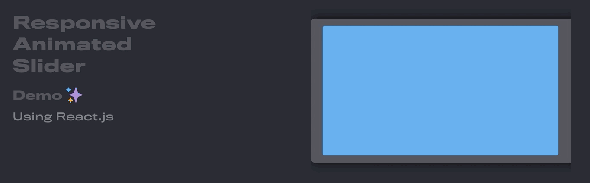

# Responsive Animated Slider

_Using React, animations and React Hooks_

A colaborative proyect made by [@pyritewolf](https://github.com/pyritewolf), [@bcardiff](https://github.com/bcardiff/), [@danimibas](https://github.com/danimibas), [@hdf1986](https://github.com/hdf1986) and [@pmallol](https://github.com/pmallol).

### Technical overview

The slider was built using the following technologies:

- [React](https://facebook.github.io/react/): a library to build the UI.
- [React Hooks](https://reactjs.org/docs/hooks-intro.html): allows you to use state and lifeCycle React features in a functional component.
- [react-spring](https://www.react-spring.io/): a library used to implement basic animations.
- [react-use-gesture](https://github.com/react-spring/react-use-gesture): another library used to bind mouse or touch events.

### Setup

1) Clone this repo
2) In a console run `$ yarn install`
3) Run `$ yarn start` to get started
4) Open a browser at `http://localhost:3000/`